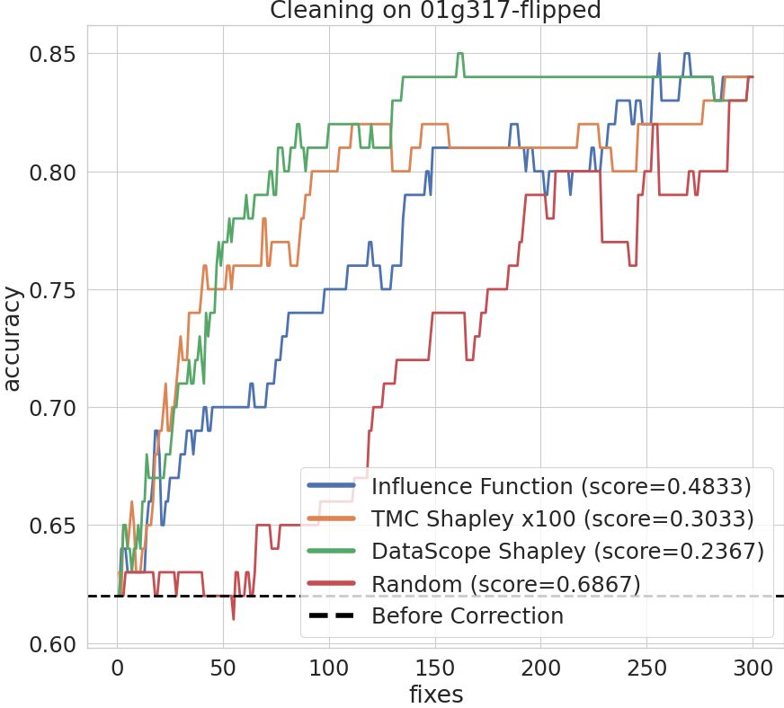
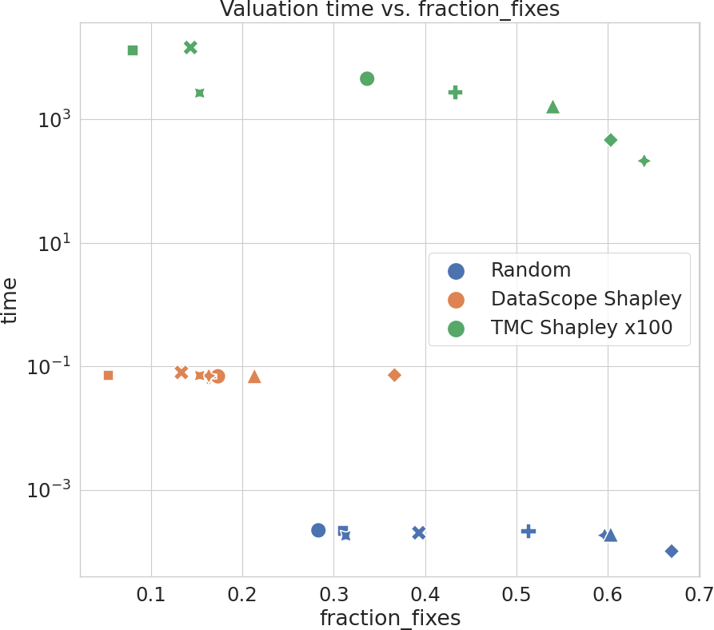

# `dataperf-vision-debugging`: A Data-Centric Vision Benchmark for Training Data Debugging


### **Current version:** alpha

This github repo serves as the starting point for offline evaluation of submissions for the training data debugging vision benchmark. The offline evaluation can be run on both your local environment as well as a containerized image for reproducibility of score results.

For a detailed summary of the a benchmark, refer to the provided [benchmark documentation](https://docs.google.com/document/d/1J8poMyW63rAmb1Rq4Ni6iAgryCcijqIGtM7cGb3cyB8/edit).

*Note that permission is required to view the benchmark documentation and download the required resources. Please join MLCommons/DataPerf Workgroup to request access or send an email to xiaozhe.yao@inf.ethz.ch*

## Requirements

### Download resources

The following resources will need to be downloaded locally in order to run offline evaluation:

- Embeddings for candidate pool of training, validation and testing images (.parquet file)
- Ground truth labels for images (.csv files)

These resources can be downloaded in a .zip file at the following url

```
https://drive.google.com/file/d/1_-WZCGd31XTENCtVjP4GqDLYShP3NzwK/view?usp=sharing
```

### Install dependencies

For running as a containerized image:
- `docker` for building the containerized image
- `docker-compose` for running the scoring service with the appropriate resources

Installation instructions can be found at the following links: [Docker](https://docs.docker.com/get-docker/), [Docker compose](https://docs.docker.com/compose/install/).

For running locally:
- Python (>= 3.7)

The current version of this repo has only been tested locally on Python 3.8 and Ubuntu 22.04.

## Installation

Clone this repo to your local machine

```
$ git clone git@github.com:DS3Lab/dataperf-vision-debugging.git
```

If you want to run the offline evaluation in your local environment, install the required python packages

```
$ pip install -r requirements.txt
```

A template filesystem with the following structure is provided in the repo. By unzipping the resource file, the embeddings and ground truth will be placed in the appropriate folders.

```
$ unzip -o cleaning_challenge_data.zip
```

The resulting filesystem in the repo should look as follows

```
|____embeddings
| |____01g317_train_0.3_300.parquet
| |____01g317_test_500.parquet
```

With the resources in place, you can now test that the system is functioning as expected.

To test the containerized offline evaluation, run

```sh
$ docker-compose run dataperf-debugging-submission
```

Similarly, to test the local python offline evaluation, run

```sh
$ python3 create_baselines.py && python3 main.py && python3 plotter.py
```

Either test will run the offline evaluation using the setup specified in `task_setup.yaml` (or `task_setup_docker.yaml`), which will utilise a training set (with some noise) and a validation set to generate baseline debugging strategies, train classification models and generate a plot in `results/` with the data id.

```
|____results
| |____01g317_evaluation.png
```

# Guidelines (alpha version)

For the alpha version of this benchmark we will only support submissions and offline evaluation for the open division.

## Open Division: Creating a submission

A valid submission for the open division includes the following:
- A description of the data selection algorithm/strategy used
- A list of data points to be inspected and corrected
- (Optional) A script of the algorithm/strategy used

Each submission must be a ```.txt``` file. Each row in the file represents the index to the image label that needs to be inspected and corrected. The submission file should be named as ```{data_id}_{your_method_name}.txt```, for example ```01g317_random.txt``` or ```01g317-flipped_neighbor_shapley.txt```.

The included training set file serves as a template of a single submission:

```
$ head examples/01g317_my_method.txt

1
2
3
4
...
```

Besides of the data points to be inspected and corrected, the submission file also contains a text file that states how long your submission takes to get the submission file. This text file is used to compare your submission with the other submissions from the aspect of speed. The text file should be named as ```time_{data_id}_{your_method_name}.txt```, for example ```time_01g317_random.txt```. It should contain a single line with the time (in seconds) it takes to run the submission. For example,

```
$ head examples/time_01g317_my_method.txt

4.6976000021459186e-05
```


## Open Division: Offline evaluation of a submission

The configuration for the offline evaluation is specified in `task_setup.yaml` file (or `task_setup_docker.yaml`). For simplicity, the repo comes pre-configured such that for offline evaluation you can simply:
1. Copy your training sets to the template filesystem
2. Modify the config file to specify the training set for each task
3. Run offline evaluation
4. See results in stdout and results file in `results/`

## Closed Division: Creating a submission

TBD.

## Closed Division: Offline evaluation of a submission

TBD.

## Interpret the Results

After running the evaluation, the results and figures are stored in `results/`. There will be one figure for each task, and an aggregated figure for all tasks.

**Figure for Each Task** 

An example figure for a single task is shown below. The x-axis represents the number of data points each algorithm inspects, and the y-axis represents the test accuracy. The black dashed horizontal line represents the initial accuracy without any debugging. Intuitive, the higher the curve, the better the performance - meaning that the debugging algorithm leads to better performance with the same number of inspections.
<p align="center">

</p>

**Aggregated Figure**

An example aggregated figure is shown below. This figure is used to compare different algorithms quantitatively. The x-axis represents the time each algorithm needs in order to find the order of debugging. Differernt shapes of marker indicates different tasks. The y-axis represents the portion of data points each algorithm needs to inspect, in order to achieve a high enough accuracy (95% of the accuracy on the cleaned training dataset). The y-axis represents the time each algorithm needs in order to find the order of debugging. Differernt shapes of marker indicates different tasks. 

Intuitively, if the algorithm is higher, the algorithm is more efficient - meaning that it can achieve the target accuracy with less number of inspections. In the meanwhile, if the algorithm is more on left, then the algorithm takes less time to perform the valuation - meaning that it can perform the valuation in shorter time.

<p align="center">

</p>
